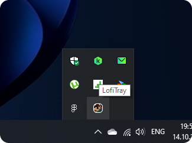
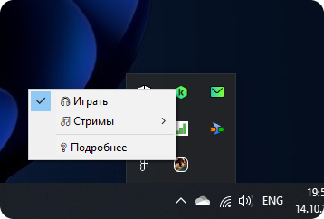
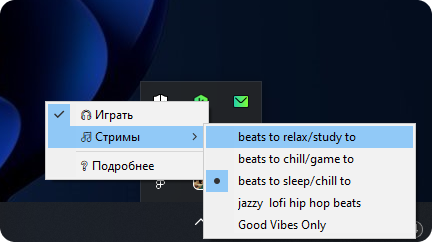

# 🎧*LofiTray* - **любая** онлайн-трансляция теперь в Вашей панели задач **в фоновом режиме**


# **Безопасность**

**Программа проверена через 69 антивирусов, в том числе:**


Проверить программу лично через kaspersky ➜ [тык](https://opentip.kaspersky.com)

# **Установка**

1) Если у Вас не установлен **VLC media player**, [**установите**](https://www.videolan.org/vlc/) его перед установкой LofiTray. С помощью API этого плеера программа воспроизводит трансляцию в фоновом режиме
2) Скачайте и запустите установщик **LofiTray** 👉[**скачать**](https://github.com/ivanoskov/lofiTray/raw/main/dist/LofiTraySetup.exe)👈
   
   Вы также можете загрузить программу [архивом](https://github.com/ivanoskov/lofiTray/raw/main/dist/LofiTray_arhive.rar). В таком случае Вам придётся самостоятельно добавлять файл `LofiTra Start.exe` в автозагрузку системы
3) Наслаждайтесь неограниченным прослушиванием трансляций с ютуба

# **Использование**
После установки на Вашей панели задач, в разделе значков (треев - Tray) появится LofiTray



## **Интерфейс**
Кликнув правой кнопкой мыши, откроется меню программы из 3 пунктов:



### 🎧 **Играть**
Это кнопка `вкл`/`выкл` музыки. Её состояние меняется в соответствии с режимом: 
- ✅ - музыка играет
- 🟩 - не играет.
### 🎵 **Стримы**



Здесь можно выбрать музыкальную (или любую другую) трансляцию из добавленных. 
Если кнопка **Играть** в положении `вкл`, то при смене трансляции, он автоматически начнёт воспроизводиться

Как добавить свою трансляцию, я описал в разделе [**Персонализация**](#персонализация)
### ❔ **Подробнее**
Кнопка вернёт Вас на *эту* страницу. Необходимо в случае возникновения каких-либо трудностей/вопросов/предложений

## **Персонализация**

Программа позволяет вносить изменения в список доступных трансляций.

Для этого  перейдите в каталог программы (по умолчанию `C:\Program Files (x86)\LofiTray`) и откройте `settings.json`:

```json
{
  "streams": {
    "beats to relax/study to": "https://www.youtube.com/watch?v=jfKfPfyJRdk",
    "beats to chill/game to": "https://www.youtube.com/watch?v=4xDzrJKXOOY",
    "beats to sleep/chill to": "https://www.youtube.com/watch?v=rUxyKA_-grg",
    "поломатое типо": "https://www.youtube.com/watch?v=rUxypKA_-gr",
    "jazzy & lofi hip hop beats": "https://www.youtube.com/watch?v=5yx6BWlEVcY",
    "Good Vibes Only": "https://www.youtube.com/watch?v=_2sGsqzFXks"
  },
  "site": "https://github.com/ivanoskov/lofiTray"
}

```

Нас интересует список `streams`. Именно из него программа получает список трансляций при запуске

Формат записи трансляции:

```json
"{Отображаемое в меню название трансляции}": "{Ссылка на ютуб-трансляцию}"
```

**! Обратите внимение, программа будет пропускать все записи, ссылки которых не являются онлайн-трансляциями на youtube (как пример добавлена записть "поломатое типа" на несуществующий стрим)**

